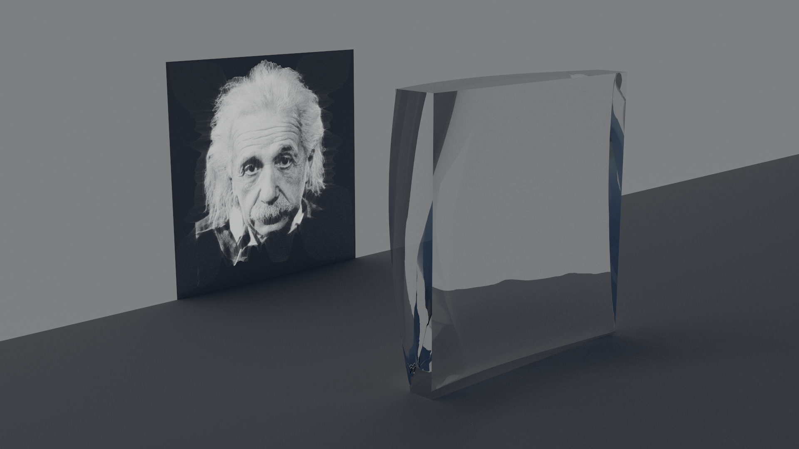

# Fast caustic design: A fast high contrast freeform optics designer based on OTMap

## Examples

#### Ring:


```
./caustic_design -res 512 -focal_l 1.5 -thickness 0.2 -width 1 -in_src ../data/source.png -in_trg ../data/ring.png
```

#### Einstein:


```
./caustic_design -res 512 -focal_l 1.5 -thickness 0.3 -width 1 -in_src ../data/source.png -in_trg ../data/einstein.png
```

## Limitation
Currently, the code produces only square lenses, though work is underway to support rectangular lenses. Circular lenses might be possible in the future; however, achieving this will require a complete rewrite of the OTMap solver.

The limitation stems from the fact that the OTMap solver is designed to compute the transport map from an image to a uniform distribution, denoted as T(u->1). Specifically, a transport map from a source image u to a target image v T(u->v) is estimated by means of inversion and composition (see Equation 10 in the paper). This approach is an estimation and not a true optimal transport map. This estimation inadvertently introduces a small curl component into the mapping.

Because deriving a heightmap for a lens relies on normal integration, which only utilizes the curl-free component of the mapping, the presence of any curl results in distortions in the caustic lens.

One solution to this issue would be to solve the transport map T(u->1) on a custom domain (think rounded rectangle, circle, ellipse, etc). This requires a rewrite because the current OTMap solver relies on a square domain with quad faces. You could use a triangular mesh as the domain and apply finite element analysis to compute the discrete differential operators. Namely the laplacian and the gradient. The laplacian uses a special stencil, and the gradient is calculated on the dual vertices, so this would not be trivial on a triangle mesh.

A second solution that may be more approachable is modifying the right hand side of equation 11 by replacing (h^2) * u(x) with the integral of u(x) / v(T(x)) over the dual cell. This should solve the full Monge-Ampère equation and yield a true L2 optimal transport map T(u->v).

## Installation

This code uses [Eigen](https://eigen.tuxfamily.org), Surface_mesh, and CImg that are already included in the repo/archive.
The only libraries you need to install are [Ceres Solver](http://ceres-solver.org/) for the normal integration and libpng/libjpg for image IO.

It is however highly recommended to install [SuiteSparse/Cholmod](http://faculty.cse.tamu.edu/davis/suitesparse.html) for higher performance.

All you need is to clone the repo, configure a build directory with cmake, and then build.
For instance:

````
$ git clone ...
$ cd fast_caustic_design
$ mkdir build
$ cd build
$ cmake ..
$ make -j8
````

## License

The core of the transport solver is provided under the [GNU Public License v3](https://www.gnu.org/licenses/gpl-3.0.html).

Utilities and applications are released under the [Mozilla Public License 2](https://www.mozilla.org/en-US/MPL/2.0/).

## References

[1] Georges Nader and Gael Guennebaud. _Instant Transport Maps on 2D Grids_. ACM Transactions on Graphics (Proceedings of Siggraph Asia 2018). [[pdf]](https://hal.inria.fr/hal-01884157) [[video]](https://www.youtube.com/watch?v=Ofz4-reJQRk)
