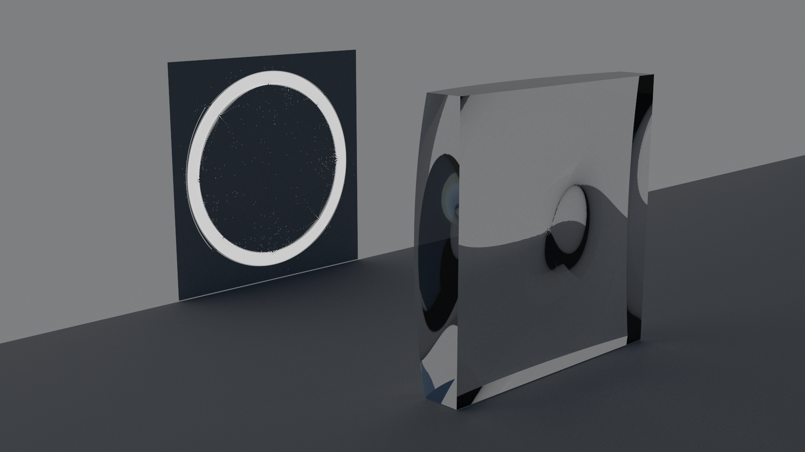

# Fast caustic design: A fast high contrast freeform optics designer based on OTMap

## Examples

#### Ring


```
./caustic_design -res 512 -focal_l 1.5 -in_src ../data/source.png -in_trg ../data/ring.png
```

## Installation

This code uses [Eigen](https://eigen.tuxfamily.org), Surface_mesh, and CImg that are already included in the repo/archive.
It is however highly recommended to install [SuiteSparse/Cholmod](http://faculty.cse.tamu.edu/davis/suitesparse.html) for higher performance, and libpng/libjpg for image IO.

All you need is to clone the repo, configure a build directory with cmake, and then build.
For instance:

````
$ git clone ...
$ cd otmap
$ mkdir build
$ cd build
$ cmake ..
$ make -j 8
````

## License

The core of the transport solver is provided under the [GNU Public License v3](https://www.gnu.org/licenses/gpl-3.0.html).

Utilities and applications are released under the [Mozilla Public License 2](https://www.mozilla.org/en-US/MPL/2.0/).

## References

[1] Georges Nader and Gael Guennebaud. _Instant Transport Maps on 2D Grids_. ACM Transactions on Graphics (Proceedings of Siggraph Asia 2018). [[pdf]](https://hal.inria.fr/hal-01884157) [[video]](https://www.youtube.com/watch?v=Ofz4-reJQRk)